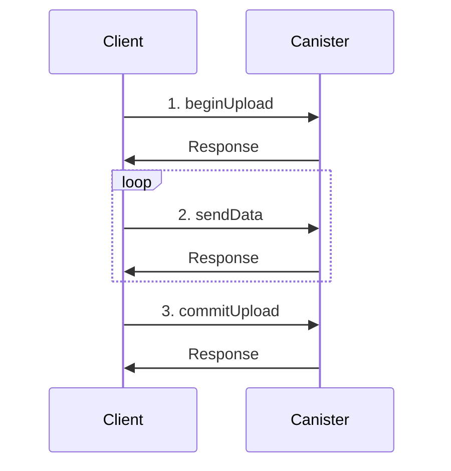

### 1. upload (less than 2MB)

upoad(path, mimetype, byte[], overwrite);


### 1. upload (resumable upload)

update callのIngressには2MB上限がある。

https://forum.dfinity.org/t/why-is-canister-code-size-limited-to-2mb/22937

プロトコルの検討



## 1. beginUpload()

beginUpload(filepath:string, )

## 2. sendData()

## 3. commitUpload()

Resumable Upload

https://asnokaze.hatenablog.com/entry/2022/02/28/010418

https://github.com/tus/rufh-implementations/blob/main/README.md

https://datatracker.ietf.org/doc/draft-ietf-httpbis-resumable-upload/


## BEGIN Transaction

| Field | Type   | Description      | Remarks      |
| :---- | :----- | :--------------- | :----------- |
| Path  | String | Path             | /photo/2020/ |
| Type  | String | MimeType         | text/plain   |
| Size  | u64    | data size (byte) | 1024         |

## SEND data

|Field|Type|
|:----|:---|
|index| |
|size | |

## Commit


### 2. download (resumable download)

### 3. filesystem (stable memory)

## 2024-08-13: Purpose

1. Storing family legacies

## 2024-08-12: Create Project

### 1. dfx new command

```bash
$ dfx --version
dfx 0.22.0
$ dfx new canistorage
✔ Select a backend language: · Rust
✔ Select a frontend framework: · No frontend canister
✔ Add extra features (space to select, enter to confirm) · 
Fetching manifest https://sdk.dfinity.org/manifest.json
Creating new project "canistorage"...
︙
```

### 2. Directory structures

```bash
canistorage
├── .git
│   ︙
├── .gitignore
├── Cargo.lock
├── Cargo.toml
├── README.md
├── dfx.json
└── src
    └── canistorage_backend
        ├── Cargo.toml
        ├── canistorage_backend.did
        └── src
            └── lib.rs
```

### 2. Toml

```bash
$ cargo install candid-extractor
$ cargo install wasi2ic
```

```bash
$ cargo add ic-stable-structures c-wasi-polyfill
```

### 3. Makefile

|start|
|stop|
|build|

### 4.


## 参考

##### The Internet Computer Interface Specification

https://internetcomputer.org/docs/current/references/ic-interface-spec#cbor


#### Cannot fetch candid file

https://forum.dfinity.org/t/cannot-fetch-candid-file/27603/2?u=toshio
